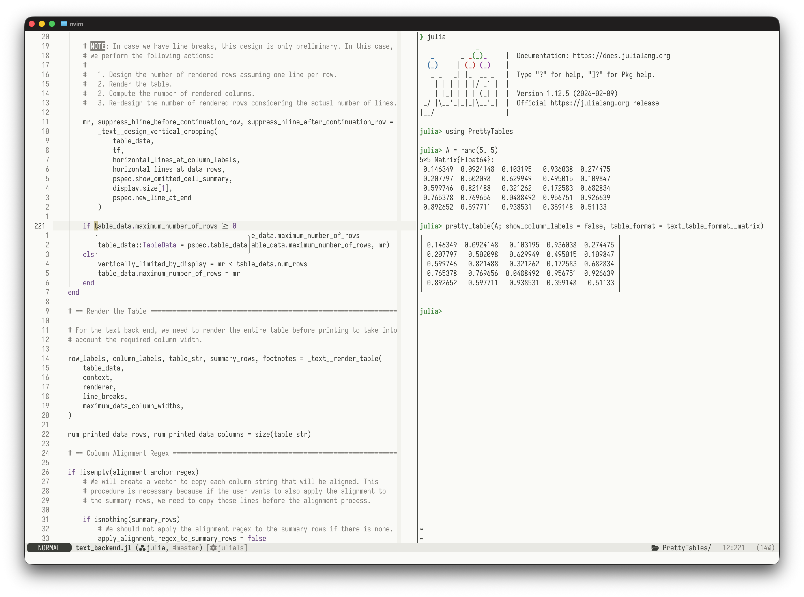
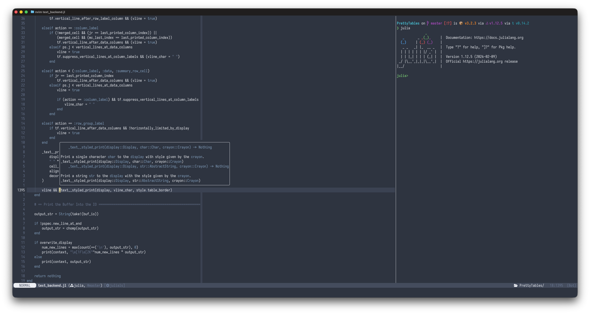

# Neovim N Λ N O Theme

This package contains my attempt to replicate in Neovim the incredible work of @rougier in
[N Λ N O Theme](https://github.com/rougier/nano-theme) for Emacs.

N Λ N O Theme is a minimalist color scheme based on six colors only:

- **Critical face** is for information that requires immediate action.

> It should be of high contrast when compared to other faces. This can be realized (for
> example) by setting an intense background color, typically a shade of red. It must be used
> scarcely.

- **Popout face** is used for information that needs attention.

> To achieve such effect, the hue of the face has to be sufficiently different from other
> faces such that it attracts attention through the popout effect.

- **Strong face** is used for information of a structural nature.

> It has to be the same color as the default color and only the weight differs by one level
> (e.g., light/regular or regular/bold). IT is generally used for titles, keywords,
> directory, etc.

- **Salient face** is used for information that are important.

> To suggest the information is of the same nature but important, the face uses a different
> hue with approximately the same intensity as the default face. This is typically used for
> links.

- **Faded face** is for information that are less important.

> It is made by using the same hue as the default but with a lesser intensity than the
> default. It can be used for comments, secondary information and also replace italic (which
> is generally abused anyway

- **Subtle face** is used to suggest a physical area on the screen.

> It is important to not disturb too strongly the reading of information and this can be
> made by setting a very light background color that is barely perceptible.

## Installation

This plugins has been tested so far using lazy.nvim as the plugin manager:

```lua
{
  "ronisbr/nano-theme.nvim",
  init = function ()
    vim.o.background = "light" -- or "dark".
  end
}
```
## Screenshots




