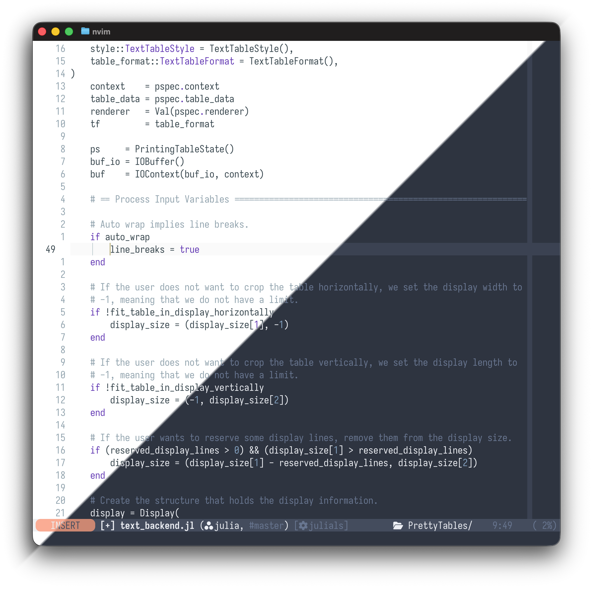
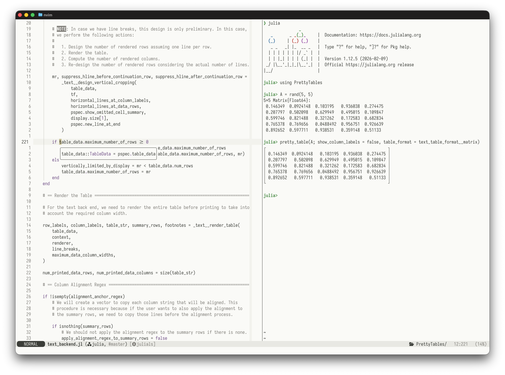
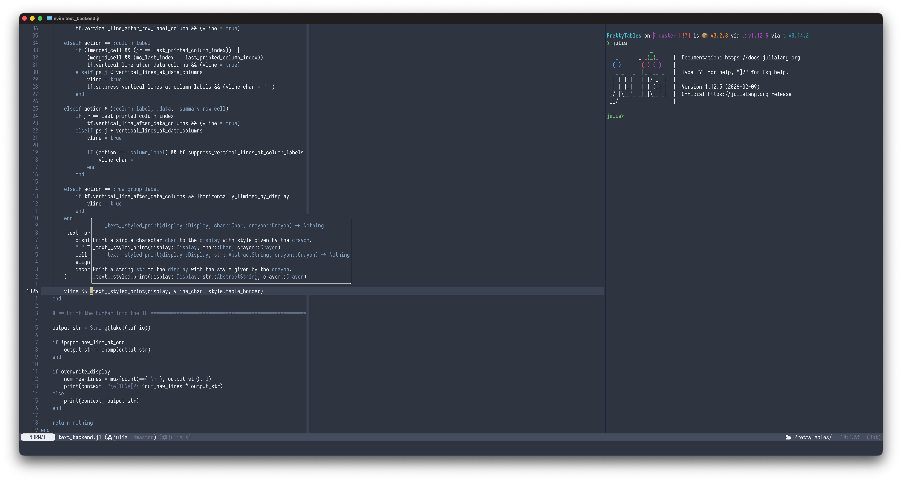

# Neovim N Λ N O Theme

<p align="center"></p>

This package contains my attempt to replicate in Neovim the incredible work of @rougier in
[N Λ N O Theme](https://github.com/rougier/nano-theme) for Emacs.

N Λ N O Theme is a minimalist color scheme based on six colors only:

- **Critical face** is for information that requires immediate action.

> It should be of high contrast when compared to other faces. This can be realized (for
> example) by setting an intense background color, typically a shade of red. It must be used
> scarcely.

- **Popout face** is used for information that needs attention.

> To achieve such effect, the hue of the face has to be sufficiently different from other
> faces such that it attracts attention through the popout effect.

- **Strong face** is used for information of a structural nature.

> It has to be the same color as the default color and only the weight differs by one level
> (e.g., light/regular or regular/bold). IT is generally used for titles, keywords,
> directory, etc.

- **Salient face** is used for information that are important.

> To suggest the information is of the same nature but important, the face uses a different
> hue with approximately the same intensity as the default face. This is typically used for
> links.

- **Faded face** is for information that are less important.

> It is made by using the same hue as the default but with a lesser intensity than the
> default. It can be used for comments, secondary information and also replace italic (which
> is generally abused anyway

- **Subtle face** is used to suggest a physical area on the screen.

> It is important to not disturb too strongly the reading of information and this can be
> made by setting a very light background color that is barely perceptible.

This version of the N Λ N O theme is slightly modified compared to the Emacs version. We
decided to make the background warmer in the light theme and remove the blue tint in the
dark version. All colors were slightly tuned to meet the minimum contrast requirements for
accessibility.

## Installation

This plugins has been tested so far using mini.deps as the plugin manager:

```lua
MiniDeps.add({ source = "ronisbr/nano-theme.nvim" })
vim.o.background = "light" -- or "dark".
vim.cmd.colorscheme("nano-theme")
```

## Configuration

You can configure the theme variant independently for light and dark backgrounds by calling
the `setup` function:

```lua
MiniDeps.add({ source = "ronisbr/nano-theme.nvim" })
vim.o.background = "light" -- or "dark".
require("nano-theme").setup({
  light_variant = "default",
  dark_variant  = "default",
})
vim.cmd.colorscheme("nano-theme")
```

### Variants

| Variant       | Description                                                                                                      |
|:--------------|:-----------------------------------------------------------------------------------------------------------------|
| `default`     | Warm, slightly tinted palette faithful to the original N Λ N O Emacs theme.                                      |
| `black_white` | High-contrast variant with near-pure black/white backgrounds and swapped salient/popout hues for extra clarity.  |
| `blue`        | Cool, steel-blue tinted palette where backgrounds and accents lean toward blue tones.                            |
| `green`       | Nature-inspired palette with green-tinted backgrounds.                                                           |
| `gray`        | Fully desaturated, neutral gray palette. Salient and popout faces use achromatic tones for a monochrome feel.    |
| `rougier`     | Palette closest to the original N Λ N O Emacs theme by @rougier, with minimal modifications.                    |

### Changing the Variant at Runtime

You can interactively select the variant for the current background using the provided
functions:

```lua
-- Open an interactive selector to change the light theme variant.
require("nano-theme").select_light_variant()

-- Open an interactive selector to change the dark theme variant.
require("nano-theme").select_dark_variant()
```

These functions open a `vim.ui.select` prompt listing all available variants. After
selecting one, the theme is reloaded immediately.

## Screenshots




